# 📄 Descriptions

[@meiokubo](https://github.com/meiokubo)'s website for 2021, hack with purpose. 🌈

Published on [https://mei.hackwith.org](https://mei.hackwith.org/), Janualy 3rd, 2021.

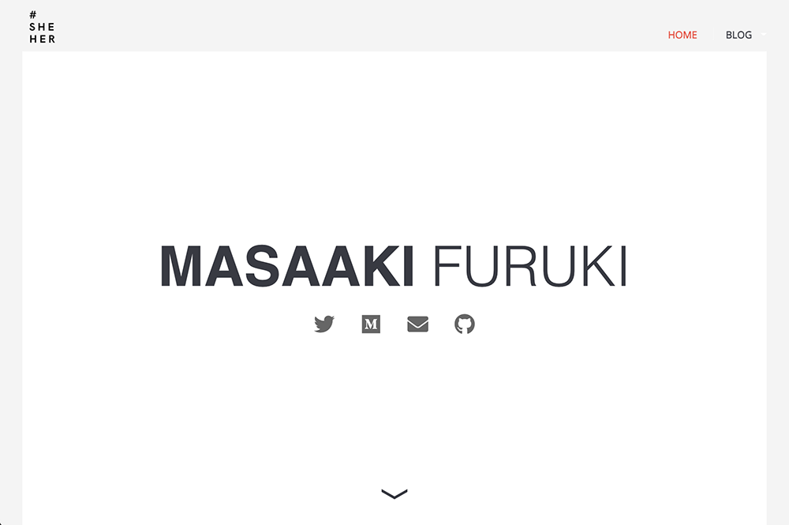

## ⚖️ License

> 💡This website is a modified **copy** of `sample project` from the [Learn Enough CSS Layout to Be Dangerous](https://www.learnenough.com/css-and-layout-tutorial/introduction). If you want to make your website like this one, you should start your course from there.

## ✅ Requirements

-   [Github Pages](https://pages.github.com/)
-   [Jekyll](https://jekyllrb.com/)

## 🪄 Scope

-   Personal website with purpose
-   Almost absolutely free and open
-   Easy to deploy & update

## 😎 Features

-   Social links
-   Blog - Jekyll
-   Newsletter - [Substack](https://hackwith.substack.com/)

## ✏️ TODOS

-   Generalized template for distribution
-   Add a dark theme
-   Add theme switch for light and dark

## ✊ Join the movement

\#hackwith is the coding tutorial newsletter that thrive with you. Start building life hack apps with me and take your coding game to the next level. 🚀

📧 Sing up from [Substack](https://hackwith.substack.com/) to get started!!

## 💛 Contribute to the movement

Wanna share your life-hack app tutorial with us?

Please email me at [mei@hackwith.org](mei@hackwith.org)

Thanks!

## ⚧ #genderpronounsmatter

I made logos for gender pronouns. You are encouraged to use your pronouns.

    # images/logos/<your pronouns>.png

#### #theythem

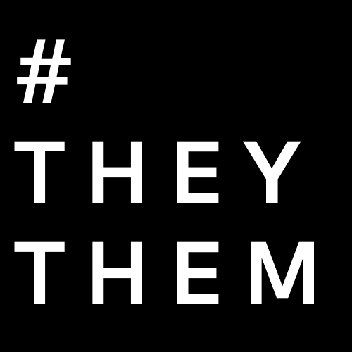

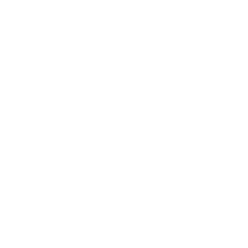

#### #sheher

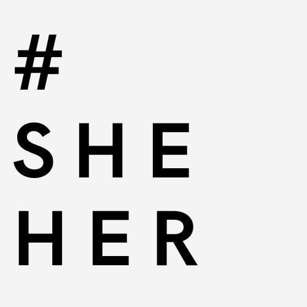

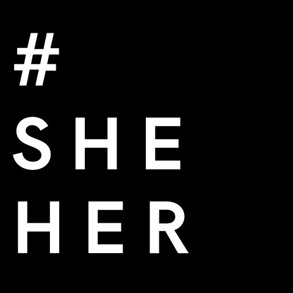

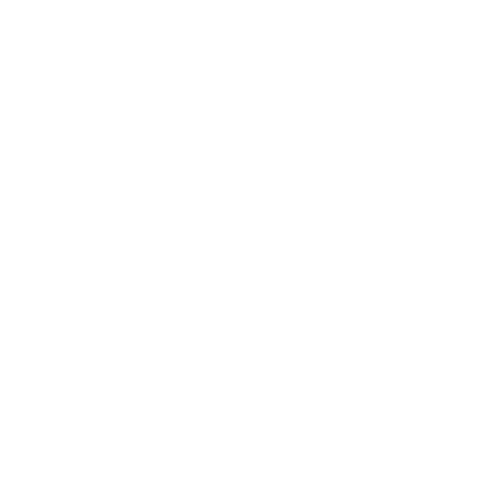

#### #hehim

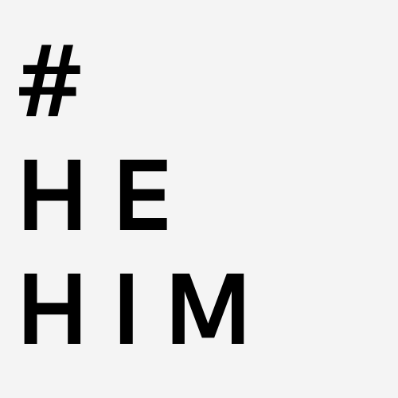

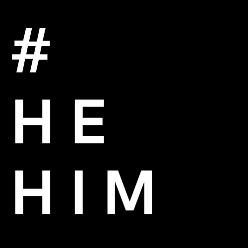

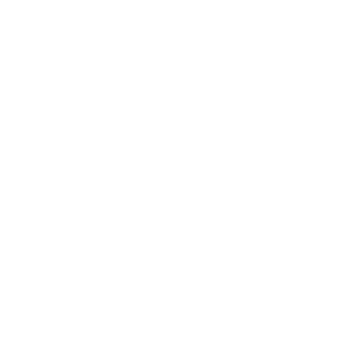

#### #hackwith

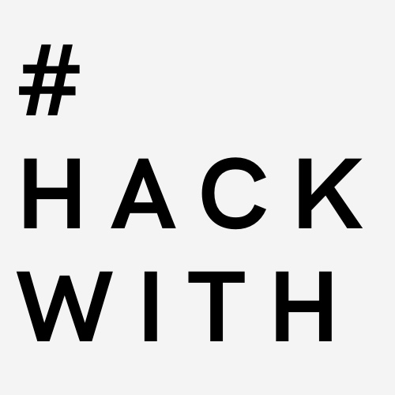

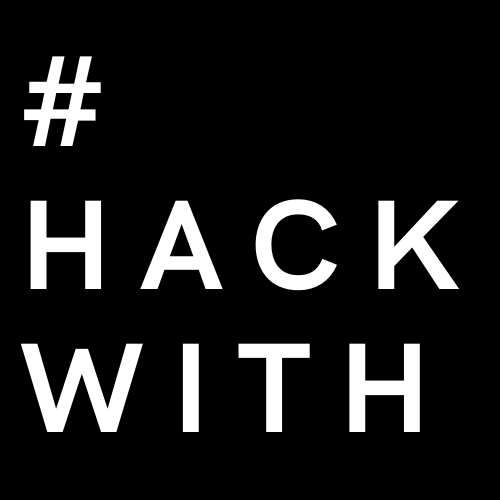

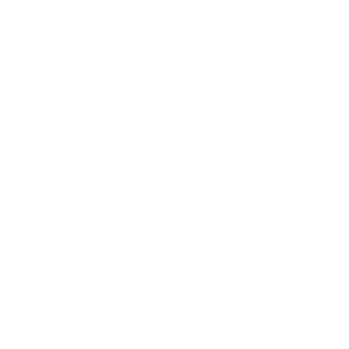

#### #hackwith logos

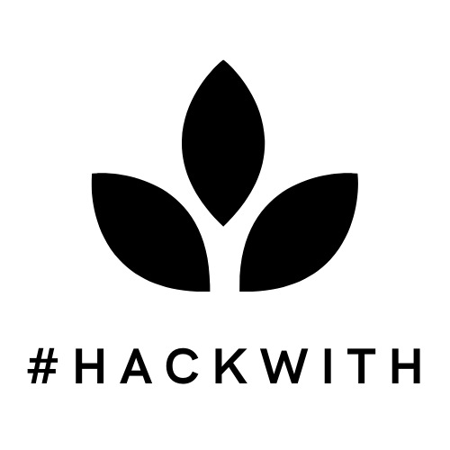

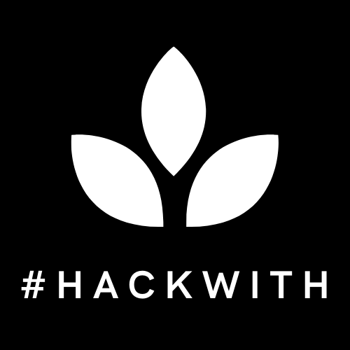

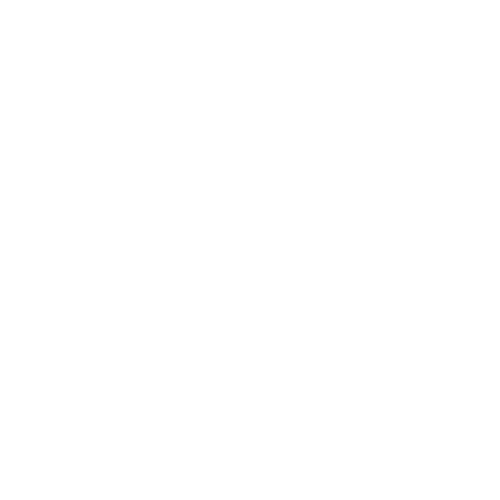

#### #hackwith icons

