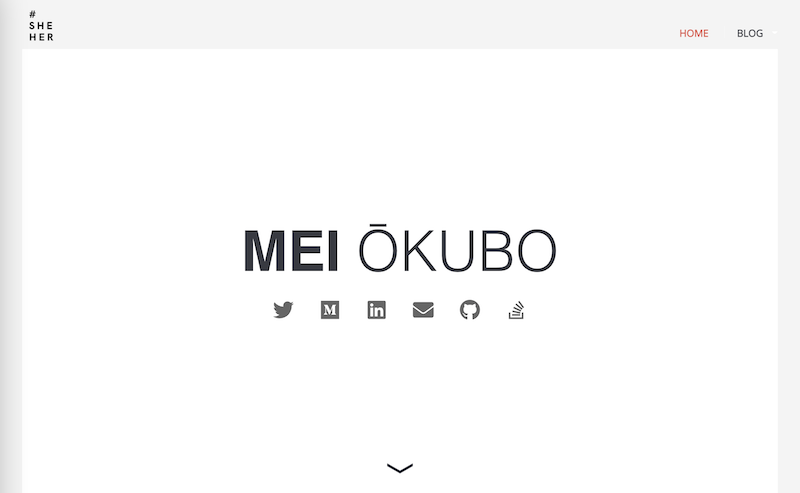

# 📄 Descriptions

[@meiokubo](https://github.com/meiokubo)'s website for 2021, hack with purpose. 🌈

Published on [https://www.meiokubo.xyz](https://www.meiokubo.xyz), June 20th, 2021.

## ⚖️ License

> 💡This website is a modified **copy** of `sample project` from the [Learn Enough CSS Layout to Be Dangerous](https://www.learnenough.com/css-and-layout-tutorial/introduction). If you want to make your website like this one, you should start your course from there.

## ✅ Requirements

-   [Github Pages](https://pages.github.com/)
-   [Jekyll](https://jekyllrb.com/)

## 🪄 Scope

-   Personal website with purpose
-   Almost absolutely free and open
-   Easy to deploy & update

## 😎 Features

-   Social links
-   Blog - Jekyll
-   Newsletter - [Substack](https://hackbymandy24.substack.com)

## ✏️ TODOS

* [X] Add Resume
* [X] Add Chatbot
* [X] Train Chatbot with personalized answers about me
* [ ] Add Spotify feed
* [ ] Add Github feed
* [ ] Add Dark mode and switch
* [ ] Make Github page template from this website

## 🗞 Subscribe to my newsletter
[Substack](https://hackbymandy24.substack.com/)

## 💛 Email me

Email me at [mei@hackwith.org](mei@hackwith.org)

Thanks!

## ⚧ #genderpronounsmatter

I made logos for gender pronouns. You are encouraged to use your pronouns.

    # images/logos/<your pronouns>.png

#### #theythem

#### #sheher

#### #hehim

#### #hackwith

##### 🎨 More variant in [images/logos/](images/logs/) directory. 👀
